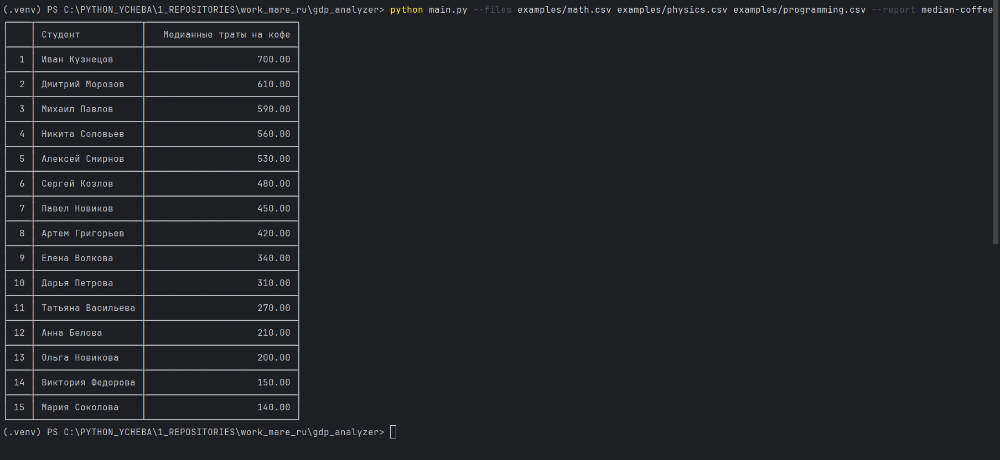

# GDP Analyzer

[](https://www.python.org/)
[](https://pypi.org/project/tabulate/)
[](https://docs.pytest.org/)
[](./docs/test.png)
[](https://github.com/psf/black)
[](LICENSE)

Инструмент для анализа данных из CSV файлов. Поддерживает макроэкономические данные и данные о подготовке студентов к экзаменам.

---

## Оглавление

- [Использование](#использование)
- [Визуальные примеры](#визуальные-примеры)
- [Формат данных](#формат-данных)
- [Примеры вывода](#примеры-вывода)
- [Обработка ошибок](#обработка-ошибок)
- [Добавление нового отчета](#добавление-нового-отчета)
- [Установка для разработки](#установка-для-разработки)
- [Запуск тестов](#запуск-тестов)
- [Архитектура проекта](#архитектура-проекта)
- [Требования](#требования)
- [Тестирование](#тестирование)
- [Лицензия и авторство](#лицензия-и-авторство)

---

## Использование

### Анализ ВВП по странам (среднее арифметическое):
```bash
  python main.py --files examples/economic1.csv examples/economic2.csv --report average-gdp
```

### Анализ трат на кофе по студентам (медиана):
```bash
  python main.py --files examples/math.csv examples/physics.csv examples/programming.csv --report median-coffee
```

### Просмотр доступных отчетов:
```bash
  python main.py --list-reports
```

### Показать справку:
```bash
  python main.py --help
```

### Параметры

| Параметр | Описание |
|----------|----------|
| `--files` | Один или несколько путей к CSV файлам с данными (обязательный, если не используется `--list-reports`) |
| `--report` | Название отчета для генерации (обязательный, если не используется `--list-reports`) |
| `--list-reports` | Показать список доступных отчетов и выйти |

---

## Визуальные примеры

| Пример | Изображение |
|--------|-------------|
| Тестирование и покрытие кода |  |
| Справка по использованию |  |
| Пример отчета average-gdp |  |
| Пример отчета median-coffee |  |

---

## Формат данных

### Для отчета `average-gdp`:
CSV файлы должны содержать колонки: `country`, `year`, `gdp`

```csv
country,year,gdp,gdp_growth,inflation,unemployment,population,continent
United States,2023,25462,2.1,3.4,3.7,339,North America
```

### Для отчета `median-coffee`:
CSV файлы должны содержать колонки: `student`, `date`, `coffee_spent`

```csv
student,date,coffee_spent,sleep_hours,study_hours,mood,exam
Алексей Смирнов,2024-06-01,450,4.5,12,норм,Математика
```

---

## Примеры вывода

### Для отчета `average-gdp`:
```bash
   ┌────┬────────────────┬──────────┐
   │    │ country        │      gdp │
   ├────┼────────────────┼──────────┤
   │  1 │ United States  │ 23923.67 │
   ├────┼────────────────┼──────────┤
   │  2 │ China          │ 17810.33 │
   └────┴────────────────┴──────────┘
```

### Для отчета `median-coffee`:
```bash
   ┌────┬───────────────────┬───────────────────────────┐
   │    │ Студент           │   Медианные траты на кофе │
   ├────┼───────────────────┼───────────────────────────┤
   │  1 │ Иван Кузнецов     │                    700.00 │
   ├────┼───────────────────┼───────────────────────────┤
   │  2 │ Дмитрий Морозов   │                    610.00 │
   └────┴───────────────────┴───────────────────────────┘
```

---

## Обработка ошибок

Приложение проверяет:

| Проверка | Описание |
|----------|----------|
| **Существование файлов** | Проверка, что все указанные файлы существуют |
| **Наличие аргументов** | Проверка обязательных аргументов `--files` и `--report` |
| **Доступность отчета** | Проверка, что запрошенный отчет зарегистрирован |
| **Кодировка файла** | Автоматический подбор кодировки (utf-8, utf-8-sig, cp1251, cp866) |

---

## Добавление нового отчета

Архитектура проекта позволяет легко добавлять новые отчеты без изменения существующего кода.

### Шаг 1: Создайте класс отчета
Создайте файл в `gdp_analyzer/reports/your_report.py`:

```python
from .base import BaseReport

class YourReport(BaseReport):
    @property
    def name(self):
        return "your-report-name"

    def generate(self, data):
        # Логика формирования отчета
        pass

    def display(self, report_data):
        # Вывод отчета в консоль
        pass
```

### Шаг 2: Зарегистрируйте отчет
В файле `gdp_analyzer/reports/registry.py`:

```python
from .your_report import YourReport
ReportRegistry.register_report(YourReport())
```

### Шаг 3: Готово!
Отчет автоматически появится в списке доступных:
```bash
  python main.py --list-reports
```

---

## Установка для разработки

```bash
# Клонирование репозитория
git clone https://github.com/svirilinmax/gdp_analyzer.git
cd gdp-analyzer

# Создание виртуального окружения
python -m venv .venv
source .venv/bin/activate  # Linux/Mac
.venv\Scripts\activate      # Windows

# Установка в режиме разработки
pip install -e .
pip install -r requirements.txt

# Установка pre-commit хуков
pre-commit install
```

---

## Запуск тестов

| Команда | Описание |
|---------|----------|
| `pytest` | Запуск всех тестов |
| `pytest --cov=gdp_analyzer` | Запуск с отчетом о покрытии |
| `pytest tests/` | Запуск тестов из папки tests |
| `pytest tests/test_median_coffee.py -v` | Запуск конкретного теста с подробным выводом |
| `pytest --cov=gdp_analyzer --cov-report=html` | Создание HTML отчета о покрытии |

---

## Архитектура проекта

```
gdp_analyzer/
├── main.py                      # Точка входа
├── gdp_analyzer/                 # Основной пакет
│   ├── cli.py                   # Обработка командной строки
│   ├── data_processor.py        # Загрузка CSV данных
│   ├── exceptions.py            # Пользовательские исключения
│   ├── reports/                  # Пакет отчетов
│   │   ├── average_gdp.py       # Отчет по среднему ВВП
│   │   ├── median_coffee.py     # Отчет по медианным тратам на кофе
│   │   ├── base.py              # Базовый класс отчета
│   │   ├── registry.py          # Реестр отчетов
│   │   └── __init__.py
├── docs/                        # Визуальные примеры работы
│   ├── average-gdp.png          # Пример отчета по ВВП
│   ├── median-coffee.png        # Пример отчета по кофе
│   ├── help.png                 # Справка по использованию
│   └── test.png                 # Результаты тестирования
├── examples/                    # Примеры данных
│   ├── economic1.csv            # Экономические данные
│   ├── economic2.csv            # Экономические данные
│   ├── math.csv                 # Данные по математике
│   ├── physics.csv              # Данные по физике
│   └── programming.csv          # Данные по программированию
├── tests/                       # Тесты
│   ├── test_cli.py
│   ├── test_data_processor.py
│   ├── test_median_coffee.py
│   ├── test_reports.py
│   └── __init__.py
└── requirements*.txt            # Зависимости
```

### Ключевые компоненты

| Компонент | Назначение |
|-----------|------------|
| **`cli.py`** | Парсинг аргументов командной строки, обработка флагов |
| **`data_processor.py`** | Загрузка CSV файлов с автоматическим определением кодировки |
| **`reports/base.py`** | Абстрактный базовый класс для всех отчетов |
| **`reports/registry.py`** | Реестр для управления зарегистрированными отчетами |
| **`reports/average_gdp.py`** | Отчет по среднему ВВП (группировка по странам) |
| **`reports/median_coffee.py`** | Отчет по медианным тратам на кофе (группировка по студентам) |

---

## Требования

- **Python**: >= 3.8
- **tabulate**: >= 0.9.0 (для форматирования таблиц)
- **pytest**: >= 7.0.0 (для разработки и тестирования)

---

## Тестирование

Проект имеет высокое покрытие тестами (**95%**). Все тесты проходят успешно.

### Структура тестов

| Файл | Назначение | Количество тестов |
|------|------------|-------------------|
| `test_cli.py` | Тестирование CLI интерфейса | 6                 |
| `test_data_processor.py` | Тестирование загрузки CSV | 5                 |
| `test_reports.py` | Тестирование базовых отчетов | 6                 |
| `test_median_coffee.py` | Тестирование отчета по кофе | 11                |
| **Всего** | | **28**            |

### Запуск с измерением покрытия
```bash
  pytest --cov=gdp_analyzer --cov-report=term-missing
```

---

## Лицензия и авторство

- **Лицензия**: MIT
- **Разработчик**: Максим Свирилин
- **Репозиторий**: [github.com/svirilinmax/gdp-analyzer](https://github.com/svirilinmax/gdp-analyzer)
- **Вопросы**: [svirilin.work@mail.ru](mailto:svirilin.work@mail.ru)
- **Telegram**: [@svirilinmax](https://t.me/svirilinmax)

---

*Data Analyzer — инструмент для анализа CSV данных с расширяемой архитектурой отчетов.*
