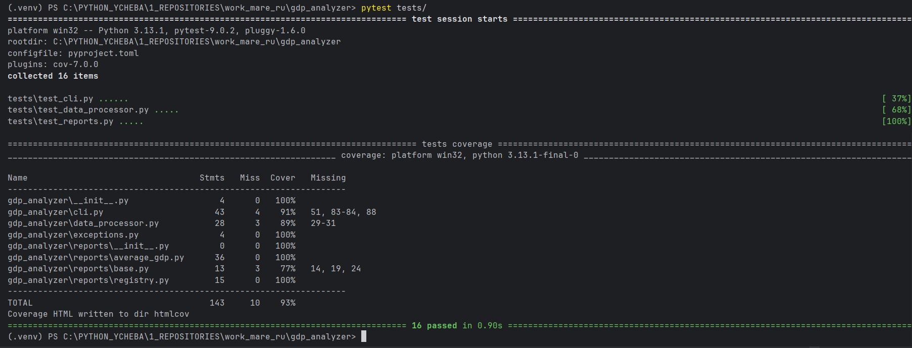
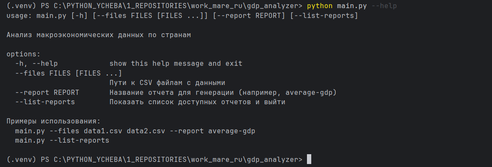
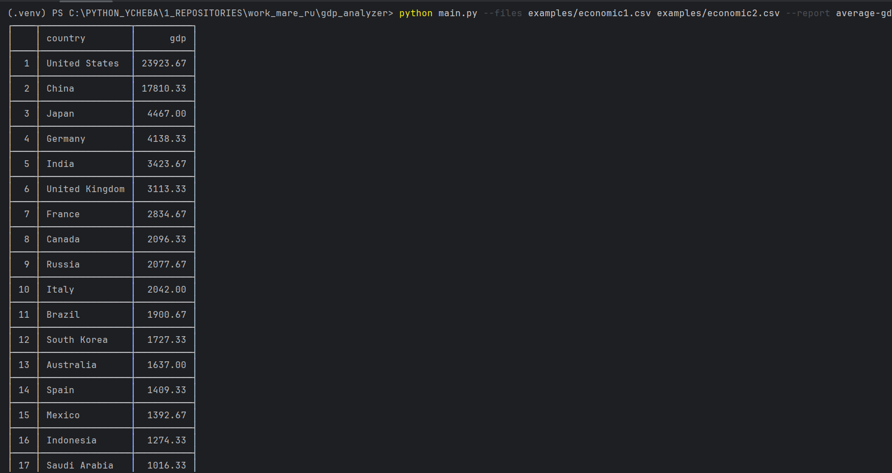

# GDP Analyzer

[](https://www.python.org/)
[](https://pypi.org/project/tabulate/)
[](https://docs.pytest.org/)
[](./docs/test.png)
[](https://github.com/psf/black)
[](LICENSE)

Инструмент для анализа макроэкономических данных по странам.
Читает CSV-файлы с экономическими показателями и формирует отчеты.

## Использование

### Основная команда:

```bash
  python main.py --files examples/economic1.csv examples/economic2.csv --report average-gdp
```
### Альтернативная команда:
```bash

  python -m gdp_analyzer.cli --files examples/economic1.csv examples/economic2.csv --report average-gdp
```

### Просмотр доступных отчетов:

```bash
  python main.py --list-reports
```

### Показать справку:

```bash
  python main.py --help
```

### Параметры

- `--files` - один или несколько путей к CSV файлам с данными (обязательный, если не используется `--list-reports`)
- `--report` - название отчета для генерации (обязательный, если не используется `--list-reports`)
- `--list-reports` - показать список доступных отчетов и выйти

## Визуальные примеры

### Тестирование и покрытие кода


### Справка по использованию


### Пример отчета average-gdp


## Формат данных

CSV файлы должны содержать колонки: `country`, `year`, `gdp` (остальные колонки опциональны).

Пример:
```csv
country,year,gdp,gdp_growth,inflation,unemployment,population,continent
United States,2023,25462,2.1,3.4,3.7,339,North America
United States,2022,23315,2.1,8.0,3.6,338,North America
United States,2021,22994,5.9,4.7,5.3,337,North America
```

## Пример вывода

```bash
   $ python main.py --files examples/economic1.csv examples/economic2.csv --report average-gdp
┌────┬────────────────┬──────────┐
│    │ country        │      gdp │
├────┼────────────────┼──────────┤
│  1 │ United States  │ 23923.67 │
├────┼────────────────┼──────────┤
│  2 │ China          │ 17810.33 │
├────┼────────────────┼──────────┤
│  3 │ Japan          │  4467.00 │
├────┼────────────────┼──────────┤
│  4 │ Germany        │  4138.33 │
├────┼────────────────┼──────────┤
│  5 │ India          │  3423.67 │
├────┼────────────────┼──────────┤
│  6 │ United Kingdom │  3113.33 │
├────┼────────────────┼──────────┤
│  7 │ France         │  2834.67 │
├────┼────────────────┼──────────┤
│  8 │ Canada         │  2096.33 │
├────┼────────────────┼──────────┤
│  9 │ Russia         │  2077.67 │
├────┼────────────────┼──────────┤
│ 10 │ Italy          │  2042.00 │
├────┼────────────────┼──────────┤
│ 11 │ Brazil         │  1900.67 │
├────┼────────────────┼──────────┤
│ 12 │ South Korea    │  1727.33 │
├────┼────────────────┼──────────┤
│ 13 │ Australia      │  1637.00 │
├────┼────────────────┼──────────┤
│ 14 │ Spain          │  1409.33 │
├────┼────────────────┼──────────┤
│ 15 │ Mexico         │  1392.67 │
├────┼────────────────┼──────────┤
│ 16 │ Indonesia      │  1274.33 │
├────┼────────────────┼──────────┤
│ 17 │ Saudi Arabia   │  1016.33 │
├────┼────────────────┼──────────┤
│ 18 │ Netherlands    │  1006.00 │
├────┼────────────────┼──────────┤
│ 19 │ Turkey         │   927.33 │
├────┼────────────────┼──────────┤
│ 20 │ Switzerland    │   845.00 │
└────┴────────────────┴──────────┘
```

## Обработка ошибок

Приложение проверяет:
- Существование указанных файлов
- Наличие обязательных аргументов
- Доступность запрошенного отчета
- Валидность данных в CSV файлах

## Добавление нового отчета

1. Создайте класс в `gdp_analyzer/reports/`, наследуясь от `BaseReport`
2. Реализуйте три обязательных метода:
   - `name` - название отчета (property)
   - `generate(data)` - логика формирования отчета
   - `display(report_data)` - вывод отчета в консоль
3. Зарегистрируйте отчет в `registry.py`:
```python
from .your_report import YourReport
ReportRegistry.register_report(YourReport())
```

## Установка для разработки

```bash
   pip install -e .
   pip install -r requirements-dev.txt
```

## Запуск тестов

```bash
   pytest                           # запуск всех тестов
   pytest --cov=gdp_analyzer        # с отчетом о покрытии
   pytest tests/                    # запуск тестов из папки tests
```

## Архитектура проекта

```
gdp_analyzer/
├── main.py                      # Точка входа
├── gdp_analyzer/
│   ├── cli.py                   # Обработка командной строки
│   ├── data_processor.py        # Загрузка CSV данных
│   ├── exceptions.py            # Пользовательские исключения
│   ├── reports/
│   │   ├── average_gdp.py       # Отчет по среднему ВВП
│   │   ├── base.py              # Базовый класс отчета
│   │   ├── registry.py          # Реестр отчетов
│   │   └── __init__.py
├── docs/                        # Визуальные примеры работы
│ ├── average-gdp.png            # Пример отчета
│ ├── help.png                   # Справка по использованию
│ └── test.png                   # Результаты тестирования
├── examples/                    # Примеры данных
├── tests/                       # Тесты
└── requirements*.txt            # Зависимости
```

## Требования

- Python >= 3.8
- tabulate >= 0.9.0
- pytest >= 7.0.0 (для разработки)

## Тестирование

Проект имеет высокое покрытие тестами (93%). Все тесты проходят успешно:

```bash
   pytest tests/
   ===============================================================================
   test session starts
   ===============================================================================
   platform win32 -- Python 3.13.1, pytest-9.0.2, pluggy-1.6.0
   collected 16 items

   tests\test_cli.py ...... [37%]
   tests\test_data_processor.py ..... [68%]
   tests\test_reports.py ..... [100%]

   ===============================================================================
   Name                                  Stmts   Miss  Cover   Missing
   -------------------------------------------------------------------
   gdp_analyzer\__init__.py                  4      0   100%
   gdp_analyzer\cli.py                      45      4    91%   58, 87-88, 92
   gdp_analyzer\data_processor.py           28      3    89%   30-32
   gdp_analyzer\exceptions.py                4      0   100%
   gdp_analyzer\reports\__init__.py          0      0   100%
   gdp_analyzer\reports\average_gdp.py      36      0   100%
   gdp_analyzer\reports\base.py             13      3    77%   14, 19, 24
   gdp_analyzer\reports\registry.py         15      0   100%
   -------------------------------------------------------------------
   TOTAL                                   145     10    93%
   Coverage HTML written to dir htmlcov
   ===============================================================================
   16 passed in 0.74s
   ===============================================================================
```
## Контакты

Проект разработан в рамках тестового задания на позицию Junior Backend Developer.

По вопросам и предложениям:

- **Telegram**: [@maxsvirilin](https://t.me/svirilinmax)
- **Email**:    [mak.svirilin@gmail.com](mailto:mak.svirilin@gmail.com)

## Лицензия

Этот проект лицензирован под лицензией MIT - см. файл [LICENSE](LICENSE).